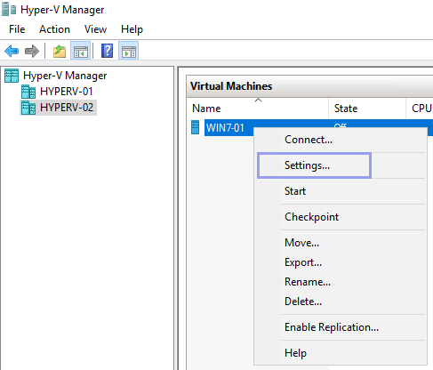
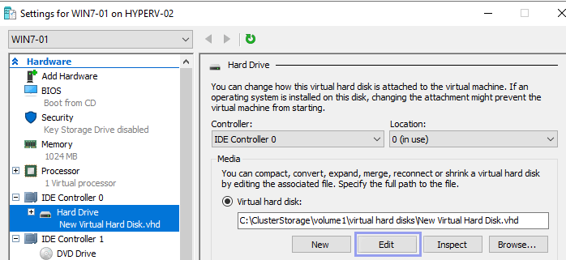
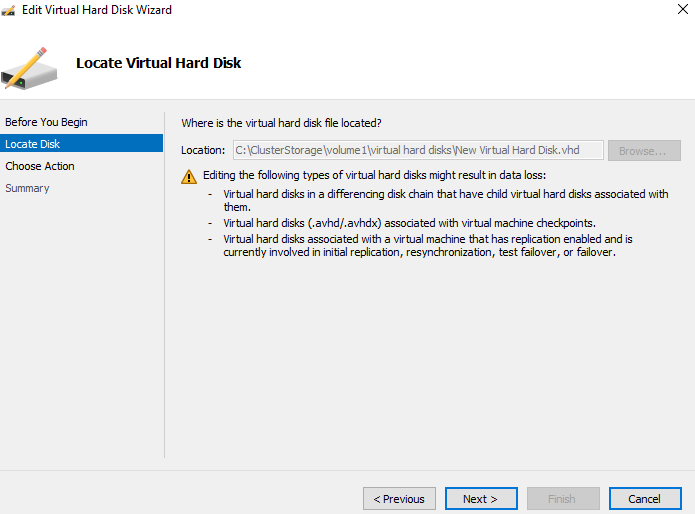
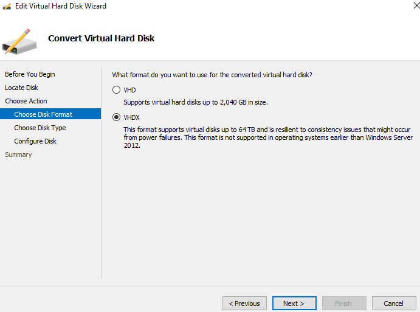
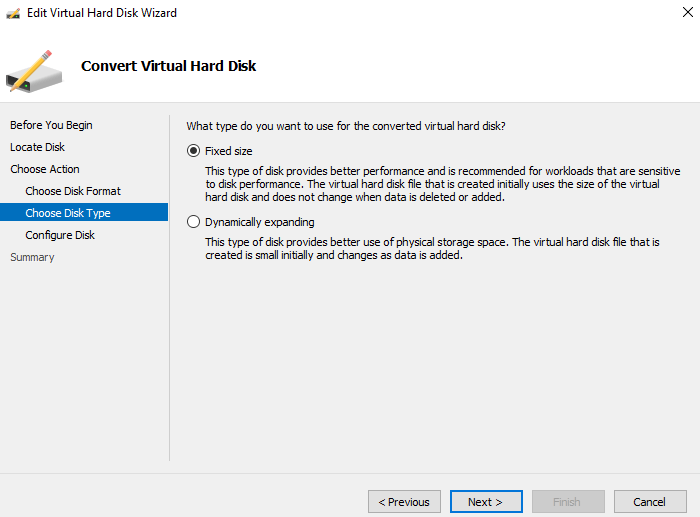
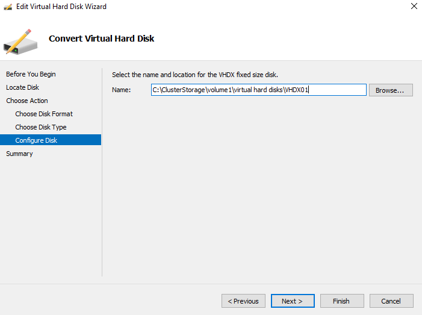
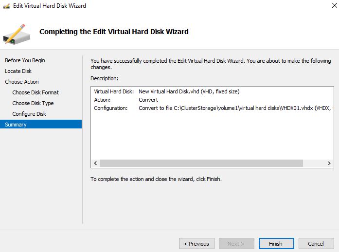
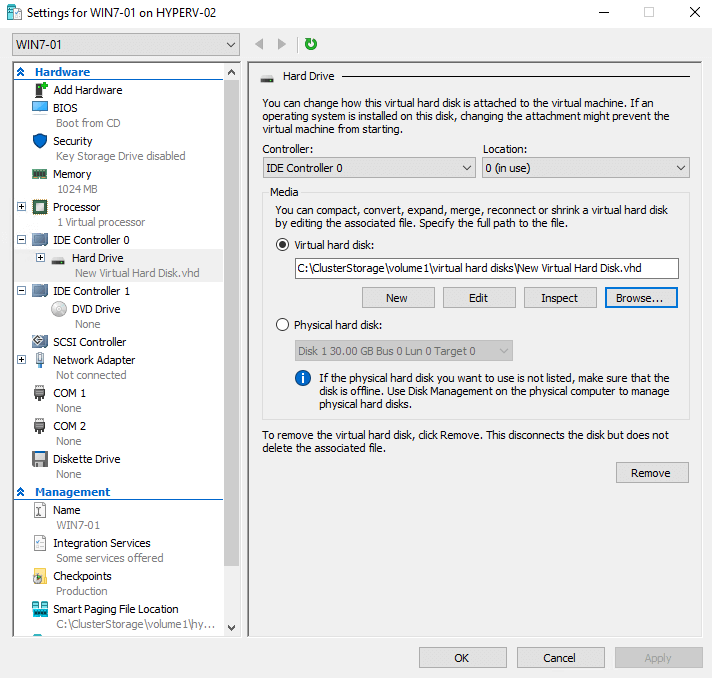

VHD and VHDX are virtual hard disk formats used in virtualization environments.

VHD - Virtual Hard Disk
VHDX - Hyper-V Virtual Hard Disk

VHDX is the newer version and provides a number of benifits. We will cover the pros and how to convert from VHD to VHDX.
VHDX is scalable up to 64TB uses 4KB block size with will improve VM performance. Protection against data corruption during power outages.
Can be resized while the VM is turned on and also better snapshot handling. 

NOTE: VHDX files cannot be used on versions of Hyper-V prior to Windows 8 or 2012.

1. Open Hyper-V Manager then select and right lcick on the virtual machine which has the disk youd like to convert.
Then select "Settings"

2. Within the hardware tab selecr the disk youd like to convert. Select Edit on the disk.

3. Click next from the Locate Disk page.

4. Select Convert and click next

5. Select the VHDX format and then click next

6. Select the type of converted disk you need. I would always recommended "Fixed Size" as the other can cause problem.

7. Enter the location to save and name the new conveted disk, Click next.

8. Click finish and start the conversion.

9. Conversion can take some time depends on the size of the disk. When done go into the settings of the virtual machine.
change the disk to the new VHDX file.

https://www.bdrsuite.com/blog/how-to-convert-vhd-to-vhdx-using-hyper-v-manager-and-powershell/